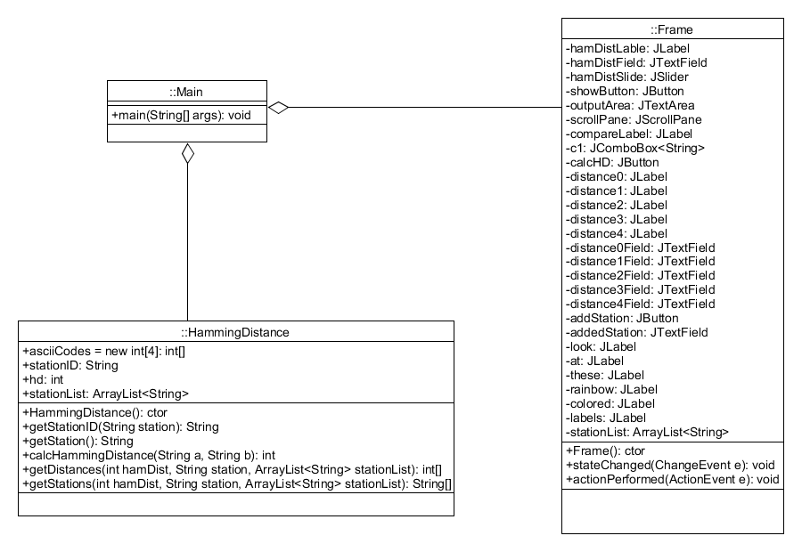

# Project5

# Documentation

## Steps
1. Created frame and UI without any logic, just to display
2. Setup event and action listeners
3. Added methods to Hamming Distance class
4. Created main method to run program

## Problem Solving Approach 
* My first approach was to tinker around with varying panel layouts to determine the best approach
* Ended up using a GridBagLayout() layout so I have maximum control over the position of components
* Used two main panels in the frame: mainPanel - main hamming distance calculations, freeDraw: free draw for whatever I want
* Added all the UI components to mainPanel for hamming distance calculations
* Used Hamming Distance class to determine the hamming distance between stations
* Finally, I created a neat little message in rainbow colors
## Classes
### Frame
* Class to create frame
* Holds all Jpanels(mainPanel, freeDraw)
* Has actionPerformed and stateChanged methods:
* actionPerformed() : Determines if the action performed was "Show Station" button, "Calculate HD" button, and "Add Station" Button
* stateChanged(): determines the slider value and inputs it into the "Entering Hamming Dist" field

### Hamming Distance
* HammingDistance(): Blank constructor
* calcHammingDistance(): Takes in two strings, splits them into corresponding character array and compares the array indexes to eachother and determines if they are different, if so, store it in variable "distance" to return
* getDistances(): Takes in Hamming Distance number, station to compare and the list of stations. Finds the distances through the use of calcHammingDistance() method.
* getStations(): Takes in Hamming Distance number, station to compare and the list of stations. Creates a string array to store the stations to return through the use of calcHammingDistance() method. 

### Main
* Main driving class that simply creates the frame object
